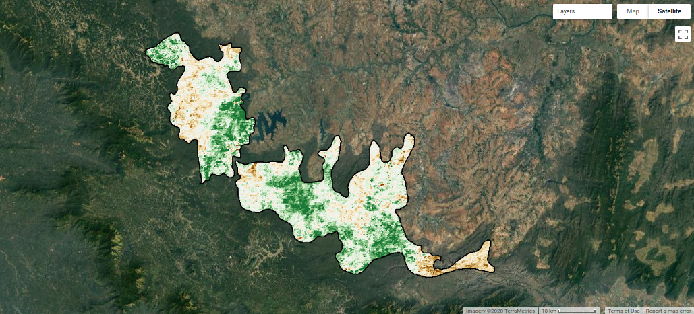
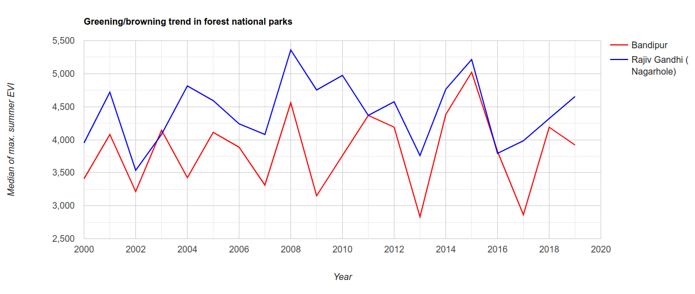

<!--
Copyright 2020 The Google Earth Engine Community Authors

Licensed under the Apache License, Version 2.0 (the "License");
you may not use this file except in compliance with the License.
You may obtain a copy of the License at

    https://www.apache.org/licenses/LICENSE-2.0

Unless required by applicable law or agreed to in writing, software
distributed under the License is distributed on an "AS IS" BASIS,
WITHOUT WARRANTIES OR CONDITIONS OF ANY KIND, either express or implied.
See the License for the specific language governing permissions and
limitations under the License.
-->

## Context

Forests around the world are in crisis. Rapidly expanding global human footprint and climate change have caused extensive deforestation, and have left remnant forests fragmented and significantly altered in condition. Yet, these remaining forests harbour a dazzling array of unique ecosystems and an overwhelming majority of our planet’s current terrestrial biodiversity, thanks to in-situ conservation efforts including those by local and indigenous communities. Valuing these forests and ensuring their continued conservation depends on our understanding their long term dynamics and responses to dominant anthropogenic and climatic drivers. This tutorial illustrates the use of Earth Engine to investigate forest vegetation condition over time.

## Rationale

Remotely sensed indices such as enhanced vegetation index (EVI), normalized difference vegetation index (NDVI) and normalized difference water index (NDWI) are widely used to estimate vegetation status from satellite imagery. EVI and NDVI estimate vegetation chlorophyll content while NDWI estimates vegetation moisture content. All these indices can be derived from free public imagery of satellites like Landsat and MODIS, available in the Earth Engine data catalog. This tutorial uses MODIS EVI data from the [MOD13Q1.006 dataset](https://developers.google.com/earth-engine/datasets/catalog/MODIS_006_MOD13Q1) for the period from year 2000 to 2019.

Bandipur and Nagarhole national parks are located in the Mysore-Malenad landscape of the Western Ghats in southern India, and are home to diverse habitats ranging from dry deciduous scrub forests to evergreen forests. Forest vegetation in this region is typically under most stress during the dry summer months, and hence, tracking annual changes during this period can be useful from a conservation and management perspective. The vegetation turns most green and abundant during the rainy monsoon months, but also becomes hard to observe from optical satellite imagery due to the accompanying heavy cloud cover.

## Approach

### Import images, features

Import the MODIS 250m/pixel 16-day composite vegetation indices dataset, and select the EVI band. Load boundaries of Bandipur and Nagarhole national parks.
```js
// get MODIS 250m EVI data 
var mod13 = ee.ImageCollection('MODIS/006/MOD13Q1')
  .select('EVI');
// get features of the forest national parks
var nps = ee.FeatureCollection('users/pradeepkoulgi/IndiaTRCondition/MainlandPAs')
  .filter(ee.Filter.inList('NAME', ['Bandipur', 'Nagarhole']));
```
### Compute annual summertime composites 

Build an image collection with an image for each year from 2000 to 2019, where the image is the maximum EVI in that year's summer months. This is our measure of the status of the vegetation for each year. Also add the year as a band, in preparation for linear trend analysis.

```js
var years = ee.List.sequence(2000, 2019);

// filter images for summer months between January and April
// and calculate yearly max EVI for those months
var mod13Summer = mod13.filter(ee.Filter.calendarRange(1, 4, 'month'));
var summerStats = ee.ImageCollection(years.map(function(year) {
  var oneYear = mod13Summer.filter(ee.Filter.calendarRange(year, year, 'year'));
  var max = oneYear.max().rename('max');
  var yr = ee.Image(ee.Number(year)).float().rename('year');
  return ee.Image.cat(max, yr).set('year', year);
}));
```

### Estimate trends and infer vegetation condition

Estimate a linear trend at each pixel by calculating its Sen's slope of maximum summer EVI with time. Infer pixel-wise vegetation greening or browning based on the sign of the slope value. Calculate summary of areas under greening and browning for each national park.

```js
var sens = summerStats.select(['year', 'max'])
                      .reduce(ee.Reducer.sensSlope());

// infer pixel-wise vegetation condition based on sign of the slope
var cond = ee.Image.cat(sens.select('slope').gt(0).rename('greening'),
                        sens.select('slope').lt(0).rename('browning'));
// calculate area under greening and browning in each national park
var npsRes = cond.multiply(ee.Image.pixelArea())
                 .reduceRegions(nps, ee.Reducer.sum(), 250);
```
### Visualise results

Tabulate the areas of vegetation greening and browning for each national park. 
```js
// tabulate total area under greening and browning
var table = ui.Chart.feature.byFeature(npsRes.select(['NAME', 'browning', 'greening']), 'NAME');
table.setChartType('Table');
print('Area (sq. m) under greening and browning', table);
```


Choose suitable visualization parameters and display the slope values on the map to denote areas under greening and browning, along with the national park boundaries.
```js
// display on map
Map.setOptions("SATELLITE");
// set visualisation parameters for greening and browning areas
var visParams = {"opacity":1,"bands":["slope"],"min":-40,"max":40,"palette":["ebb801","ffffff","76cc04"]};
Map.addLayer(sens.clipToCollection(nps), visParams, "Sen's slope");
// draw forest boundaries
var paimg = ee.Image().byte().paint(nps, 0, 2);
Map.addLayer(paimg, {palette:'#000000'}, 'National Parks');
Map.centerObject(nps, 10);
```


Chart the median of maximum summer EVIs in each national park over the years.

```js
// plot trend in EVI data by national park and year
var chart = ui.Chart.image.seriesByRegion(summerStats, nps, ee.Reducer.median(), 'max', 250, 'year', 'NAME');
chart = chart.setChartType('ScatterChart');
chart = chart.setOptions({
  title: 'Greening/browning trend in forest national parks',
  vAxis: {
    title: 'Median of max. summer EVI'
  },
  hAxis: {
    title: 'Year'
  },
  lineWidth: 1,
  pointSize: 0,
  series: {
    0: {color: 'ff0000'},
    1: {color: '0000ff'}
  }
});
print(chart);
```


